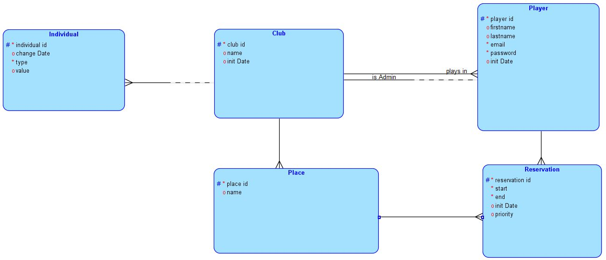
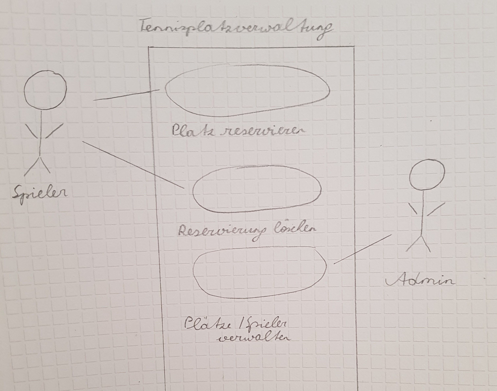

# **Pflichtenheft**
____
Projektbezeichnung: Tennisplatzreservierung  
Projektleiter:  Lukas Feck-Melzer  
Erstellt am:    13/11/2017  
Zustand: in Bearbeitung  
Dokumentenablage:  

### Weitere Produktinformationen
Mitwirkend: Lukas Feck-Melzer,
Lukas Erhart,
Mario Lengauer,
Jonas Schürz

### Änderungsverzeichnis
|Version| geänderte Kapitel| Beschreibung der Änderung| Autor
|-------|-------------|--------------|-------------|
|  0.1  | Alle| Erstellung| Mario Lengauer|
|  0.2  | Alle | Überarbeitung | Lukas Feck-Melzer

## Inhalt
- 1 Motivation...
- 2 Ausgangssituation und Zielsetzung...
   - 2.1 Ausgangssituation...
      - 2.1.1 Beschreibung des Problembereiches...
      - 2.1.2 Glossar...
      - 2.1.3 Modell des Problembereichs...
      - 2.1.4 Beschreibung der Geschäftsprozesse...
   - 2.2 Zielbestimmung...
- 3 Funktionale Anforderungen...
   - 3.1 Use Case Diagramme...
- 4 Nicht-funktionale Anforderungen...
- 5 Mengengerüst...
- 6 Risikoakzeptanz...
- 7 Lieferumfang...
- 8 Abnahmekriterien...
- 9 Abkürzungsverzeichnis...
- 10 Literaturverzeichnis...
- 11 Abbildungsverzeichnis...

## 1 Motivation
Dieses Projekt wird im Rahmen des Gegenstandes "SYP" durchgeführt. Es soll die Reservierung von Plätzen in Tennisvereinen vereinfachen.

## 2 Ausgangssituation und Zielsetzung
### 2.1 Ausgangssituation
Ein Tennisverein hat ein Reservierungssteckbrett wo Mitglieder festlegen können, wann diese spielen möchten. 

##### 2.1.1 Beschreibung des Problembereichs
Das Problem dabei ist, dass das Mitglied persöhnlich hinfahren muss um 
festlegen zu können wann dieser spielen möchte. 

#### 2.1.2 Glossar
#### 2.1.3 Modell des Problembereichs

#### 2.1.4 Beschreibung der Geschäftsprozesse
Name des Geschäftsprozesses | Auslösendes Ereignis | Ergebnis | Mitwirkende
------------------ | ---------------|----------|-----------------
Platz reservieren | Ein Spieler will einen Platz reservieren | Spieler hat sich einen Platz reserviert| Spieler
Reservierung löschen| Ein Spieler will einen reservierten Platz wieder löschen | Der reservierte Platz ist nun wieder frei | Spieler
Plätze verwalten | Der Tennisverein bekommt einen neuen Platz | Man kann nun den Platz reservieren | Admin
Spieler verwalten | Ein neuer Spieler möchte dem Verein beitreten | Spieler kann sich nun einloggen und reservieren | Admin
### 2.2 Zielbestimmung
Diese Webanwendung wird zum Reservieren der Tennisplätze verwendet werden.  
Die Zielgruppe wird von jungen Leuten bis zu älteren Leuten reichen. Deswegen setzen wirleichte Computerkenntnisse vorraus.
## 3 Funktionale Anforderungen
Das Projekt soll die Tennisplatzreservierung vereinfachen.
### 3.1 Use Case Diagramme

## 4 Nicht-funktionale Anforderungen
Die Webapplikiation soll sowohl von jungen als auch von älteren Menschen bedient werden, weshalb sie intuitiv und leicht zu verstehen sein muss. Außerdem muss die Software leicht wartbar sein.
## 5 Mengengerüst
Am Anfang werden es 5 Tennisvereine sein. Diese Zahl wird im Laufe der Zeit steigen. 
Wir schätzen mit täglich 10 Reservierungen pro Tennisverein.  
   
## 3.Aufgabenstellung
Die Aufgabe des Projektteams ist es, eine Website zu erstellen, dass das Reservieren von Tennisplätzen beinhaltet.
## 6 Risikoakzeptanz
## 7 Lieferumfang
Es wird nur einen Zugang für einen Admin geben, welcher die User erstellen/ verwalten kann und die Anzahl der Plätze konfigurieren kann.
## 8 Abnahmekriterien
Die Platzreservierung muss fehlerfrei funktionieren.
## 9 Abkürzungsverzeichnis
## 10 Literaturverzeichnis
## 11 Abbildungsverzeichnis
- Abb. 1: Klassendiagramm.png
- Abb. 2: UseCaseDiagram.png
